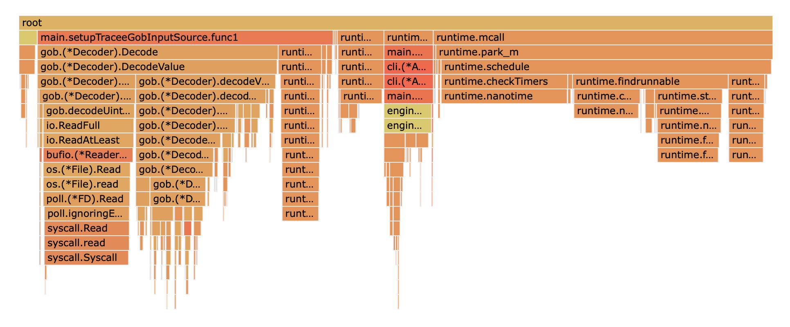

# onlyflames
Just a collection of flame graphs for research purposes

## Quick flamegraph primer
1. Go flamegraphs traverse top to bottom in call chain hierarchy.
2. Width of each flame represents the total time (CPU/Memory) taken up by that call.
3. Colours don't mean anything.
