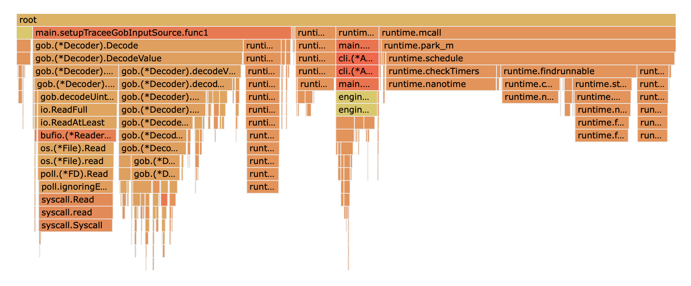

## Scenario

In this test, tracee-ebpf and tracee-rules were both run in the background and a clean kernel compilation was performed for a total of 5 minutes. A total of 67 fairly simple Rego signatures were used.


### Current Main branch
Biggest CPU offenders:
1. Rego Eval (~50%)
2. runtime (~20%)
3. A handful of Rego Eval related process on the right (~20%)

   
It is interesting to note that `ast.InterfaceToValue` and `util.RoundTrip` both called by Rego Eval are visible in the as part of the call stack of doing Rego Eval.

   
### Improving Rego util.RoundTrip
Biggest CPU offenders:
1. Rego Eval (~20%)
2. runtime (~20%)
3. A handful of Rego Eval related process on the right (~20%)
4. ConsumeSources (~20%)

   
After we eliminate `util.RoundTrip` from performing Marshaling and Unmarshaling of each JSON object, we observe that each Rego Eval has gone down by ~30% CPU usage but at the same time another ~20% penalty was paid to manually conduct `ast.InterfaceToValue` and `ToUnstructured` calls to create Prepared Events for Rego to avoid `util.RoundTrip`. This resulted in an overall ~10% CPU gain.

### All-In-One Rego Policy
Biggest CPU offenders:
1. Rego Eval (~50%)
2. runtime (~20%)
3. A handful of Rego Eval related process on the right (~15%)

   
In this experiment, we front loaded all Rego policies into one single Rego engine. In addition we loaded a grouping policy that would loop over each individual policy and match across all. An example of this grouping policy:
```rego
package main
default match = false
match {
  data.custom_policies[_].match
}
```

In this case Rego Eval worsened to nearly ~50% of the CPU time. 


### Eliminating OPA
Biggest CPU offenders:
1. Gob Decoder (~40%)
2. runtime (~50%)

   
In this experiment, we removed Rego Evalation and magically, all of our CPU consumption went away. What is interesting to note is that Gob Decoder which was previously a tiny sliver of usage is now infact the only big CPU usage. 

We can also notice that an extra penalty cost we had to pay in all the previous tests of running OPA (~15-20%) is now also eliminated. 

While this experiment purely eliminates OPA to see how policies would evaluate without it, the learning is that Rego Eval call is extremely expensive in all of the above mentioned situation.
